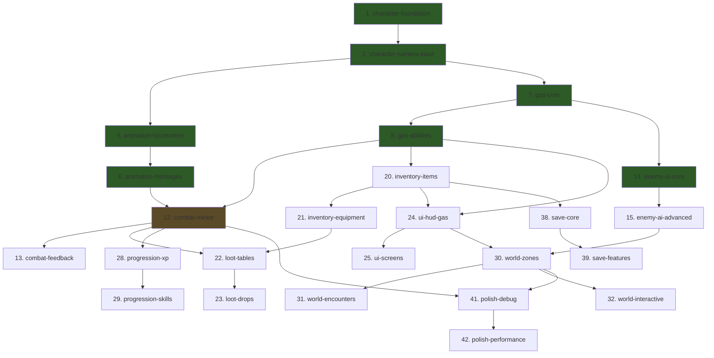

# PoF Harness — 50-Module Autonomous Build Scenario

> Project: PoF (Pillars of Fortune) — UE5 5.7.3 ARPG
> Path: `C:\Users\kazda\Documents\Unreal Projects\PoF`
> 174 source files across 13 directories
> Generated: 2026-03-31

## Current Project State

The UE5 project has significant existing implementation. The harness reviews, improves, and fills gaps — it doesn't start from scratch.

| Module | Checklist | Features | Avg Quality | Status |
|--------|-----------|----------|-------------|--------|
| arpg-character | 2/2 | 10 impl | 4.4/5 | Mature |
| arpg-animation | 6/7 | 6 impl | 3.5/5 | Nearly complete |
| arpg-gas | 7/8 | not reviewed | — | Needs review |
| arpg-combat | 7/8 | 6 impl, 1 partial | 3.8/5 | Nearly complete |
| arpg-enemy-ai | 8/8 | 8 impl | 3.9/5 | Complete |
| arpg-inventory | 8/8 | 3 impl, 1 partial | 3.6/5 | Needs polish |
| arpg-loot | 0/2 | 0 impl, 4 partial, 3 miss | 2.3/5 | Needs work |
| arpg-ui | 8/8 | not reviewed | — | Needs review |
| arpg-progression | 8/8 | not reviewed | — | Needs review |
| arpg-world | — | 1 impl, 3 partial, 4 miss | 2.5/5 | Early stage |
| arpg-save | 2/2 | not reviewed | — | Needs review |
| arpg-polish | — | not reviewed | — | Not started |

---

## 50-Module Build Order

Organized in 6 tiers of increasing dependency depth. Each module = one harness executor session (~3-10 min).

### Tier 0 — Foundation (no dependencies)

| # | Area ID | Module | Description | Features | Deps |
|---|---------|--------|-------------|----------|------|
| 1 | `character-foundation` | arpg-character | Base character, game mode, movement (walk, sprint, dodge) | 5 | — |
| 2 | `character-camera-input` | arpg-character | Camera system, enhanced input, player controller | 5 | #1 |
| 3 | `input-core` | input-handling | Enhanced Input actions, mapping contexts, key rebinding | 6 | — |
| 4 | `physics-core` | physics | Collision profiles, physics materials, trace utilities | 6 | — |

### Tier 1 — Core Systems (depend on character)

| # | Area ID | Module | Description | Features | Deps |
|---|---------|--------|-------------|----------|------|
| 5 | `animation-locomotion` | arpg-animation | AnimInstance, blend spaces, locomotion state machine | 5 | #1, #2 |
| 6 | `animation-montages` | arpg-animation | Attack montages, notifies, motion warping, root motion | 4 | #5 |
| 7 | `gas-core` | arpg-gas | AbilitySystemComponent, attribute sets, gameplay effects | 4 | #1, #2 |
| 8 | `gas-abilities` | arpg-gas | Concrete abilities, gameplay tags, cues, ability tasks | 3 | #7 |
| 9 | `models-pipeline` | models | Static/skeletal mesh import, LOD, collision, Nanite | 8 | — |
| 10 | `audio-core` | audio | Sound manager, ambient system, MetaSounds | 6 | — |
| 11 | `ui-hud-core` | ui-hud | Main menu, HUD framework, floating damage numbers | 7 | — |

### Tier 2 — Combat & AI (depend on GAS + animation)

| # | Area ID | Module | Description | Features | Deps |
|---|---------|--------|-------------|----------|------|
| 12 | `combat-melee` | arpg-combat | Melee attacks, combo system, hit detection, GAS damage | 4 | #7, #8, #5, #6 |
| 13 | `combat-feedback` | arpg-combat | Hit reactions, death flow, combat feedback, dodge ability | 4 | #12 |
| 14 | `enemy-ai-core` | arpg-enemy-ai | AI controller, enemy base, perception, behavior trees | 4 | #1, #7, #8 |
| 15 | `enemy-ai-advanced` | arpg-enemy-ai | EQS queries, archetypes, enemy abilities, spawn system | 4 | #14 |
| 16 | `ai-behavior-system` | ai-behavior | BT system, EQS, perception, group AI, state trees | 7 | — |
| 17 | `materials-core` | materials | Master material, dynamic instances, MPC, functions | 4 | #9 |
| 18 | `materials-advanced` | materials | Post-process, HLSL nodes, layer system, Substrate | 4 | #17 |
| 19 | `animations-content` | animations | Blend spaces, montage system, motion matching, retarget | 6 | #9 |

### Tier 3 — Economy & UI (depend on combat + inventory)

| # | Area ID | Module | Description | Features | Deps |
|---|---------|--------|-------------|----------|------|
| 20 | `inventory-items` | arpg-inventory | Item definition, item instance, inventory component | 3 | #7, #8 |
| 21 | `inventory-equipment` | arpg-inventory | Equipment slots, equip/unequip GAS flow, consumables, affixes | 4 | #20 |
| 22 | `loot-tables` | arpg-loot | Loot table data, weighted selection, world items | 3 | #20, #21, #12 |
| 23 | `loot-drops` | arpg-loot | Drop on death, pickup, visual feedback, chest actors | 4 | #22 |
| 24 | `ui-hud-gas` | arpg-ui | HUD widget, GAS attribute binding, enemy HP bars, ability cooldowns | 4 | #7, #8, #20 |
| 25 | `ui-screens` | arpg-ui | Inventory screen, character stats, damage numbers, menus | 4 | #24 |
| 26 | `dialogue-quests-core` | dialogue-quests | Dialogue assets, branching conversations, NPC interaction | 3 | — |
| 27 | `dialogue-quests-system` | dialogue-quests | Quest tracker, objectives, quest log UI | 3 | #26 |

### Tier 4 — Progression & World (depend on combat + UI + loot)

| # | Area ID | Module | Description | Features | Deps |
|---|---------|--------|-------------|----------|------|
| 28 | `progression-xp` | arpg-progression | XP/level attributes, XP curve, XP on kill, level-up | 4 | #7, #8, #12 |
| 29 | `progression-skills` | arpg-progression | Active abilities, unlock system, attribute points, loadout | 4 | #28 |
| 30 | `world-zones` | arpg-world | Zone layout, blockout levels, NavMesh coverage | 3 | #14, #15, #24 |
| 31 | `world-encounters` | arpg-world | Enemy spawn placement, boss encounter, environmental hazards | 3 | #30 |
| 32 | `world-interactive` | arpg-world | Interactive objects, zone transitions | 2 | #30 |
| 33 | `level-design-core` | level-design | Blockout geometry, spawn points, streaming, zone transitions | 4 | #9, #17 |
| 34 | `level-design-advanced` | level-design | Hazards, NavMesh, procedural generation, PCG, vegetation | 5 | #33 |
| 35 | `multiplayer-core` | multiplayer | Replicated properties, RPC framework, GameState | 4 | — |
| 36 | `multiplayer-advanced` | multiplayer | Session management, prediction, net relevancy, Iris | 3 | #35 |
| 37 | `procedural-core` | procedural-engine | Procedural mesh, PCG framework, noise, scatter | 5 | — |

### Tier 5 — Persistence & Polish (depend on most systems)

| # | Area ID | Module | Description | Features | Deps |
|---|---------|--------|-------------|----------|------|
| 38 | `save-core` | arpg-save | USaveGame, custom serialization, save/load functions | 4 | #20, #7, #8 |
| 39 | `save-features` | arpg-save | Auto-save, slot system, versioning | 3 | #38 |
| 40 | `save-load-system` | save-load | USaveGame subclass, save/load, auto-save, versioning | 6 | — |
| 41 | `polish-debug` | arpg-polish | Structured logging, debug draw, console commands | 3 | #12, #30 |
| 42 | `polish-performance` | arpg-polish | Object pooling, tick optimization, async asset loading | 3 | #41 |

### Tier 6 — Content, Packaging & Final (all systems available)

| # | Area ID | Module | Description | Features | Deps |
|---|---------|--------|-------------|----------|------|
| 43 | `audio-advanced` | audio | Dynamic music, reverb volumes, concurrency | 3 | #10 |
| 44 | `asset-viewer-core` | asset-viewer | Preview and inspect game assets | 4 | — |
| 45 | `asset-forge` | asset-forge | AI-powered asset generation from text prompts | 3 | #44 |
| 46 | `material-lab` | material-lab | Material preview, layer system, Substrate | 3 | #44 |
| 47 | `blender-pipeline` | blender-pipeline | DCC integration, export optimization, auto-LOD | 4 | — |
| 48 | `import-automation` | import-automation | Batch FBX/glTF import with configuration | 3 | #44, #47 |
| 49 | `packaging-ship` | packaging | Build config, cooking, platform setup, validation | 5 | — |
| 50 | `integration-test` | game-director | Full integration playtest — Game Director runs all systems | — | All |

---

## Dependency Graph (Mermaid)



---

## Running Procedure

### Prerequisites

1. PoF webapp cloned and dependencies installed (`npm install`)
2. UE5 project at `C:\Users\kazda\Documents\Unreal Projects\PoF`
3. Claude Code CLI installed and authenticated (`claude --version`)

### Dry Run (preview plan without executing)

```bash
cd C:\Users\kazda\kiro\pof

npx tsx src/lib/harness/run-harness.ts \
  --project "C:/Users/kazda/Documents/Unreal Projects/PoF" \
  --name "PoF" \
  --ue-version "5.7.3" \
  --dry-run
```

### Run Single Area

```bash
npx tsx src/lib/harness/run-harness.ts \
  --project "C:/Users/kazda/Documents/Unreal Projects/PoF" \
  --name "PoF" \
  --ue-version "5.7.3" \
  --max-iterations 1 \
  --timeout 1800000
```

### Run Full Tier (batch)

```bash
# Run until all dependency-resolved areas complete or 10 iterations
npx tsx src/lib/harness/run-harness.ts \
  --project "C:/Users/kazda/Documents/Unreal Projects/PoF" \
  --name "PoF" \
  --ue-version "5.7.3" \
  --max-iterations 10 \
  --timeout 1800000
```

### Run All 50 Modules

```bash
npx tsx src/lib/harness/run-harness.ts \
  --project "C:/Users/kazda/Documents/Unreal Projects/PoF" \
  --name "PoF" \
  --ue-version "5.7.3" \
  --max-iterations 100 \
  --target-pass-rate 90 \
  --timeout 1800000
```

### Via API (with Next.js dev server running)

```bash
# Start
curl -X POST http://localhost:3000/api/harness \
  -H "Content-Type: application/json" \
  -d '{"action":"start","projectPath":"C:/Users/kazda/Documents/Unreal Projects/PoF","projectName":"PoF","ueVersion":"5.7.3"}'

# Check progress
curl http://localhost:3000/api/harness

# Get guide
curl http://localhost:3000/api/harness?action=guide

# Pause
curl -X POST http://localhost:3000/api/harness \
  -H "Content-Type: application/json" \
  -d '{"action":"pause"}'

# Resume
curl -X POST http://localhost:3000/api/harness \
  -H "Content-Type: application/json" \
  -d '{"action":"resume"}'
```

### Monitor Progress

```bash
# Watch state files
cat .harness/game-plan.json | jq '.passingFeatures, .totalFeatures'
cat .harness/progress.json | jq '.[-1]'
cat .harness/guide.md
cat .harness/AGENTS.md
```

### Ctrl+C Safe

The harness handles SIGINT gracefully — it pauses after the current iteration completes, saves state, and can be resumed.

---

## Post-Run Cleanup (IMPORTANT)

Each harness run spawns Claude Code sessions that may create git worktrees under `.claude/worktrees/`. These accumulate and consume significant disk space. **Always clean up after a harness run completes.**

### 1. Clean Worktrees

```bash
# List all worktrees
git worktree list

# Remove all stale worktrees (safe — only removes already-deleted directories)
git worktree prune

# Remove specific worktrees
git worktree remove .claude/worktrees/<name> --force

# Nuclear option — remove ALL harness-created worktrees
rm -rf .claude/worktrees/*/
git worktree prune
```

### 2. Archive Harness State

After extracting the guide and learnings, the state files can be large (progress.json grows with every iteration). Archive or remove them:

```bash
# Copy deliverables to docs/
cp .harness/guide.md docs/harness/
cp .harness/guide.json docs/harness/
cp .harness/AGENTS.md docs/harness/harness-learnings.md

# Archive full state (optional)
tar -czf harness-run-$(date +%Y%m%d).tar.gz .harness/

# Clean state for next run
rm -rf .harness/
```

### 3. Clean Claude Logs

The harness executor writes logs to `.claude/logs/`. These grow with each session:

```bash
# Remove harness-related logs (keeps manual terminal logs)
rm -f .claude/logs/terminal_exec-*.log

# Or remove all logs
rm -rf .claude/logs/
```

### 4. Full Cleanup Script

```bash
#!/bin/bash
# Run after harness completes to reclaim disk space

echo "Cleaning worktrees..."
rm -rf .claude/worktrees/*/
git worktree prune

echo "Archiving harness state..."
cp .harness/guide.md docs/harness/ 2>/dev/null
cp .harness/AGENTS.md docs/harness/harness-learnings.md 2>/dev/null

echo "Removing harness state..."
rm -rf .harness/

echo "Cleaning logs..."
rm -f .claude/logs/terminal_exec-*.log

echo "Done. Freed space:"
du -sh .claude/ 2>/dev/null
```

Run in both the PoF webapp directory AND the UE5 project directory — the harness operates in the UE5 project path.

---

## Output Artifacts

| File | Purpose | Size (typical) |
|------|---------|---------------|
| `.harness/game-plan.json` | Master state — all areas with feature pass/fail status | ~50 KB |
| `.harness/progress.json` | Chronological log of every iteration | ~100-500 KB |
| `.harness/guide.json` | Structured guide data | ~80 KB |
| `.harness/guide.md` | **The deliverable** — reproducible playbook for other LLM sessions | ~2,000 lines |
| `.harness/AGENTS.md` | Accumulated learnings — fed into future sessions | ~150 lines |
| `.claude/worktrees/` | **Temp** — git worktrees from spawned sessions. **Delete after run.** | 100+ MB |
| `.claude/logs/` | **Temp** — execution logs. **Delete after run.** | 10-50 MB |

---

## Expected Timeline

| Tier | Areas | Est. per area | Est. total |
|------|-------|---------------|------------|
| 0 — Foundation | 4 | 3-5 min | ~15 min |
| 1 — Core Systems | 7 | 5-8 min | ~45 min |
| 2 — Combat & AI | 8 | 5-10 min | ~60 min |
| 3 — Economy & UI | 8 | 5-8 min | ~50 min |
| 4 — Progression & World | 10 | 5-10 min | ~75 min |
| 5 — Persistence & Polish | 5 | 3-5 min | ~20 min |
| 6 — Content & Ship | 8 | 3-5 min | ~30 min |
| **Total** | **50** | | **~5 hours** |

Cost estimate: ~50 iterations × ~$0.50-1.00 per session = **$25-50** in API costs.
