# PoF Harness — UI/UX Overhaul Scenario

> **Target:** PoF webapp (`C:\Users\kazda\kiro\pof`)
> **Goal:** Transform all 7 core-engine unique tabs from prototype-grade to production-grade studio tools capable of handling 100+ entities per module
> **Verification:** `npm run validate` (typecheck + lint + test)
> **Estimated areas:** 38 | **Estimated iterations:** 60–90 | **Estimated time:** 6–10 hours

---

## Problem Statement

The current unique tabs are **proof-of-concept UIs** with:
- **10–15 mock items** hardcoded — no filtering, search, grouping, or pagination
- **Feature Map** is a simple toggle list — provides no insight into feature state
- **No logical flow** — tabs are arbitrarily ordered with no chronological narrative
- **Inconsistent visual quality** — typography, spacing, contrast, and chart rendering vary across modules
- **No scale support** — rendering 100+ characters/items/abilities causes unusable layouts

The overhaul addresses three axes: **Scaling**, **Usability**, and **Visual Quality**.

---

## Design System Directive (themeDirective)

> Injected into EVERY harness executor session prompt. This is the visual law.

```
DESIGN DIRECTIVE — PoF Studio UI

You are building a professional game development studio tool. Every component must
feel like it belongs in Unreal Editor, Houdini, or Substance Designer — not a
generic web dashboard.

TYPOGRAPHY RULES:
- Headings: Geist Mono, uppercase, tracking-wider, text-xs (12px)
- Body: Geist Sans, text-sm (14px), color: var(--text) #e0e4f0
- Secondary: text-xs (12px), color: var(--text-muted) #7d82a8
- Numbers/stats: Geist Mono, font-bold, with text-shadow glow matching accent
- NEVER use text smaller than 10px (text-2xs) except for badge counters
- ALWAYS maintain WCAG AA contrast (4.5:1) against var(--background) #0a0a1a
- Muted text (#7d82a8) on dark bg (#0a0a1a) = 4.8:1 ratio — this is the floor

COLOR RULES:
- Import ALL colors from @/lib/chart-colors — never hardcode hex
- Use TAB_ACCENT[moduleId] for the module's primary accent
- Status: STATUS_SUCCESS (green), STATUS_WARNING (amber), STATUS_ERROR (red)
- Backgrounds: withOpacity(color, OPACITY_8) for subtle tints
- Borders: withOpacity(color, OPACITY_20) for visibility
- Hover borders: withOpacity(color, OPACITY_37) for emphasis
- NEVER use pure white text — use var(--text) #e0e4f0

SPACING RULES:
- Panel padding: p-3 (12px) minimum
- Gap between cards: gap-3 (12px)
- Section margin: mb-4 (16px)
- Use 4px grid: gap-1 (4px), gap-2 (8px), gap-3 (12px), gap-4 (16px)

COMPONENT RULES:
- Cards: BlueprintPanel from _design.tsx with CornerBrackets
- Headers: SectionHeader from _design.tsx with animated gradient rule
- Stats: GlowStat from _design.tsx with entrance animation
- Progress: NeonBar from _design.tsx with glow
- Radar: RadarChart from _shared.tsx for multi-axis comparison
- Timeline: TimelineStrip from _shared.tsx for temporal data
- Heatmap: HeatmapGrid from _shared.tsx for matrix data
- ALWAYS use motion.div entrance animations (opacity 0→1, y 8→0)
- ALWAYS respect prefers-reduced-motion

CHART RULES:
- All charts are custom SVG — no external chart libraries
- Grid lines: stroke white at 8% opacity
- Axis labels: Geist Mono, text-2xs, fill var(--text-muted)
- Data strokes: 2px minimum, with drop-shadow filter for glow
- Hover: ring-1 white/30 + tooltip with bg-surface-deep
- Interactive elements: cursor-pointer + focus:outline ring

SCALING RULES:
- Lists > 20 items MUST use virtual scrolling or pagination
- All entity selectors MUST support search + group-by
- Default view shows first page / first group only
- Group headers show count badge
- Empty states: centered text-muted message with icon
```

---

## Phase 0 — Shared Infrastructure

> **Must complete before any per-module work.** These create the reusable building blocks.

### Area 0.1: Scalable Entity Selector

**ID:** `infra-entity-selector`
**Deps:** none
**Session scope:** Create `src/components/shared/ScalableSelector.tsx`

**Requirements:**
- Modal overlay triggered by a compact selector button
- Search input with debounced filtering (300ms)
- Group-by dropdown: items grouped into collapsible sections (by category, level range, area, type)
- Virtual scroll for groups with 100+ items (use `@tanstack/react-virtual` or manual IntersectionObserver)
- Multi-select mode with selection counter badge
- Single-select mode with immediate close on pick
- Item renderer slot (render prop) — each module provides its own card
- Keyboard navigation: arrow keys, Enter to select, Escape to close
- Selected items shown as compact pills above the trigger button
- Props: `items: T[]`, `groupBy: (item: T) => string`, `renderItem`, `onSelect`, `selected`, `searchKey`, `placeholder`, `mode: 'single' | 'multi'`

**Component structure:**
```
ScalableSelector/
  index.tsx          — Main modal component
  SelectorSearch.tsx — Search input with clear button
  SelectorGroup.tsx  — Collapsible group header with count
  SelectorGrid.tsx   — Virtual-scrolled item grid
  types.ts           — Generic types
```

**Verification:** typecheck passes, component renders with 200 mock items without layout break

---

### Area 0.2: Feature Map Card System

**ID:** `infra-feature-cards`
**Deps:** none
**Session scope:** Replace toggle-list FeatureMapTab with card-grid matrix

**Requirements:**
- Replace `FeatureMapTab.tsx` with a card-based grid layout
- Each feature = a `FeatureCard` component, NOT a toggle row
- Card states: **active** (colored background tint, bright border), **inactive** (muted, desaturated)
- Click to toggle — no separate toggle widget
- Each card shows:
  - Feature name (top, mono font, bold)
  - Metric content area (middle) — unique per feature, passed as children or render prop
  - Status indicator (bottom-right corner dot: green/amber/red)
- Card layout: CSS grid, `grid-cols-2 sm:grid-cols-3 lg:grid-cols-4`, gap-3
- Tab groups become section headers above card groups
- "Enable All" / "Disable All" buttons remain at top
- Total active/total counter with NeonBar progress

**New files:**
```
src/components/shared/FeatureCard.tsx        — Individual card
src/components/shared/FeatureCardGrid.tsx     — Grid layout with sections
```

**Update:** `src/components/modules/core-engine/unique-tabs/FeatureMapTab.tsx` — use new components

**Metric slot pattern:**
```tsx
<FeatureCard id="bindings" label="Bindings" active={isVisible('bindings')} onClick={() => toggle('bindings')}>
  <BindingMetric implemented={12} designed={17} />
</FeatureCard>
```

---

### Area 0.3: Design Token Standardization

**ID:** `infra-design-tokens`
**Deps:** none
**Session scope:** Audit and standardize border opacities, glow radii, and spacing

**Requirements:**
- Add to `chart-colors.ts`:
  - `BORDER_DEFAULT = OPACITY_20` (standardize all border opacities)
  - `BORDER_HOVER = OPACITY_37`
  - `BORDER_SUBTLE = OPACITY_10`
  - `GLOW_SM = '0 0 4px'`, `GLOW_MD = '0 0 8px'`, `GLOW_LG = '0 0 16px'`
- Update `_design.tsx` and `_shared.tsx` to use these instead of ad-hoc values
- Add to `globals.css`:
  - `--panel-padding: 12px` (p-3)
  - `--card-gap: 12px` (gap-3)
  - `--section-gap: 16px` (gap-4)
- Do NOT change visual appearance — only consolidate tokens
- Grep all unique-tabs/ for hardcoded hex opacity suffixes and replace with imported constants

---

### Area 0.4: Metadata Schema for UE5 Entities

**ID:** `infra-metadata-schema`
**Deps:** none
**Session scope:** Define metadata JSON schema for categorizing game entities

**Requirements:**
- Create `src/types/game-metadata.ts` with interfaces:
  ```ts
  interface EntityMetadata {
    id: string;
    name: string;
    category: string;       // e.g., "Warrior", "Mage", "Beast"
    subcategory?: string;   // e.g., "Melee", "Ranged"
    tags: string[];         // free-form tags: ["boss", "humanoid", "area-1"]
    level?: number;         // suggested level range start
    levelMax?: number;      // suggested level range end
    area?: string;          // world area: "Taris", "Dantooine"
    tier?: string;          // rarity/power tier: "common", "elite", "legendary"
    icon?: string;          // optional icon identifier
  }

  interface EntityGrouping {
    field: keyof EntityMetadata;
    label: string;
    order?: string[];  // explicit group ordering
  }
  ```
- Create default groupings per module type:
  - Characters: group by `category` (class) → `subcategory` (role)
  - Items: group by `category` (weapon/armor/consumable) → `tier` (rarity)
  - Abilities: group by `category` (offensive/defensive/utility) → `tags`
  - Enemies: group by `area` → `tier`
- Extend each module's `data.ts` to include metadata on mock items (add `category`, `tags`, `area`, `tier` fields)
- This metadata format will later be populated from UE5 project exports

---

## Phase 1 — Per-Module Feature Map Metrics

> Each module's Feature Map tab gets unique metric visualizations inside FeatureCards.
> **Deps:** `infra-feature-cards` must complete first.

### Area 1.1: Character Blueprint Feature Metrics

**ID:** `ui-character-feature-metrics`
**Module:** `arpg-character`
**Deps:** `infra-feature-cards`

**Card metric definitions:**

| Feature Card | Metric Visualization | Data Source |
|---|---|---|
| **Class Hierarchy** | `{types} types / {classes} classes` — two numbers side by side | Count unique archetypes and class hierarchy depth from data |
| **Properties** | Stacked mini bars: HP range, Speed range, Armor range | Min/max from BLUEPRINT_PROPERTIES |
| **Scaling** | Sparkline: stat curve preview (tiny SVG, 60×20px) | First 10 points of scaling curve |
| **Hitbox** | `{zones} zones` with tiny colored dots (hurtbox=red, hitbox=blue, pushbox=green) | HITBOX_ZONES count by type |
| **Camera** | Three compact stats: `FOV`, `Arm`, `Lag` | Camera profile defaults |
| **Bindings** | Colored bar: `{bound}/{total}` with fill ratio | INPUT_BINDINGS implemented vs total |
| **Keyboard** | `{conflicts}` conflict count (red if >0, green if 0) | Scan bindings for duplicates |
| **States** | `{count} states` with mini state-machine icon | MOVEMENT_STATES length |
| **Dodge Trajectories** | `{distance}m` dodge distance as single bold number | From movement config |
| **Curve Editor** | Tiny sparkline of feel curve | Generated sample points |
| **Optimizer** | Preset name or "No preset" in muted text | Current preset from store |
| **Comparison** | `{dupes} duplicates` — red if >0 | Compare stat arrays for identical profiles |
| **Balance** | Mini radar thumbnail (40×40px SVG) | Averaged stats |

---

### Area 1.2: Animation State Graph Feature Metrics

**ID:** `ui-animation-feature-metrics`
**Module:** `arpg-animation`
**Deps:** `infra-feature-cards`

| Feature Card | Metric | Source |
|---|---|---|
| **States** | `{n} states / {g} groups` | STATE_NODES, STATE_GROUPS |
| **Transitions** | `{n} edges` with mini directed-graph icon | Transition count |
| **Heatmap** | Micro heatmap grid (4×4, 20px) | Top-4 state visit frequency |
| **Chain** | `{n} combos / depth {d}` | COMBO_CHAIN_NODES |
| **Montages** | `{n} montages` | Montage list length |
| **Scrubber** | `{n} notifies` across timeline | Notify count |
| **Skeleton** | `{mapped}/{total}` bone mapping bar | Retarget coverage |
| **Trajectories** | `{n} root motion curves` | Trajectory asset count |
| **Assets** | `{size}MB` estimated anim memory | Sum montage sizes |
| **Playrate** | `{min}–{max}x` playrate range | Playrate config bounds |

---

### Area 1.3: Ability Spellbook Feature Metrics

**ID:** `ui-gas-feature-metrics`
**Module:** `arpg-gas`
**Deps:** `infra-feature-cards`

| Feature Card | Metric | Source |
|---|---|---|
| **Architecture** | `ASC → {n} GA → {n} GE` pipeline count | Ability/effect counts |
| **Radar** | Mini radar (40px) with 3-ability overlay | ABILITY_RADAR_DATA |
| **Cooldowns** | `{avg}s avg` / `{min}–{max}s range` | Cooldown stats |
| **Timeline** | Micro timeline strip (60px wide) | First 3 combo events |
| **Effects Timeline** | `{n} active / {n} passive` effects split | GE type categorization |
| **Tags** | `{n} tags / {depth} depth` tree stats | TAG_TREE traversal |
| **Hierarchy** | `{n} roots / {n} leaves` | Tag tree structure |
| **Audit** | `{n} warnings` — green if 0, amber/red if >0 | Tag audit results |
| **Dependencies** | `{n} deps / {n} circular` — red if circular >0 | Dep graph analysis |

---

### Area 1.4: Combat Action Map Feature Metrics

**ID:** `ui-combat-feature-metrics`
**Module:** `arpg-combat`
**Deps:** `infra-feature-cards`

| Feature Card | Metric | Source |
|---|---|---|
| **Lanes** | `{n} lanes / {n} actions` | LANES, action count |
| **Sequences** | `{n} events / {n} systems` | SEQ_EVENTS, SEQ_LANES |
| **Traces** | `{sphere} sphere / {capsule} capsule` trace type counts | Trace config |
| **Stats** | `{avg} avg DPS` bold number | Calculated from damage data |
| **Feedback Tuner** | `{tuned}/{total}` params bar | FEEDBACK_PARAMS |
| **DPS** | Mini bar chart (3 bars for top abilities) | Top 3 DPS values |
| **Effectiveness** | `{best}` top ability name | Highest effectiveness score |
| **Sankey** | `{flows} flows` between systems | Flow connection count |
| **KPIs** | Traffic light: 3 dots (TTK, DPS, APM) | KPI threshold checks |

---

### Area 1.5: Enemy Bestiary Feature Metrics

**ID:** `ui-bestiary-feature-metrics`
**Module:** `arpg-enemy-ai`
**Deps:** `infra-feature-cards`

| Feature Card | Metric | Source |
|---|---|---|
| **Cards** | `{n} archetypes` with role pie (melee/ranged/tank/support) | ARCHETYPES |
| **Modifiers** | `{n} modifiers / {n} exclusions` | ELITE_MODIFIERS |
| **Radar** | Mini radar comparing weakest vs strongest | Min/max stat profiles |
| **Behavior Tree** | `{n} nodes / {d} depth` | BT structure |
| **Decision Log** | `{n} decisions/sec` throughput | Decision rate |
| **Aggro** | `{n} threat sources` | Aggro table size |
| **Formations** | `{n} formations` with mini dot-pattern | Formation templates |
| **Waves** | `{n} waves / {total} enemies` | Wave config sums |
| **Difficulty** | Sparkline of difficulty curve | Difficulty per wave |

---

### Area 1.6: Item Catalog Feature Metrics

**ID:** `ui-items-feature-metrics`
**Module:** `arpg-inventory`
**Deps:** `infra-feature-cards`

| Feature Card | Metric | Source |
|---|---|---|
| **Grid** | `{n} items / {slots} slots` | DUMMY_ITEMS, EQUIPMENT_SLOTS |
| **Sets** | `{n} sets / {bonuses} bonuses` | ITEM_SETS |
| **Loadout** | `{equipped}/{slots}` slot fill bar | LOADOUT_SLOTS |
| **Sources** | `{n} source types` | Economy source categories |
| **Scaling** | Sparkline: item power vs level | Scaling curve preview |
| **Stats** | `{avg} avg ilvl` | Mean item level |
| **Power** | `{min}–{max}` power range bar | Item power range |

---

### Area 1.7: Loot Table Visualizer Feature Metrics

**ID:** `ui-loot-feature-metrics`
**Module:** `arpg-loot`
**Deps:** `infra-feature-cards`

| Feature Card | Metric | Source |
|---|---|---|
| **Pipeline** | `{stages} stages` in flow | Pipeline step count |
| **Weights** | Mini pie: rarity distribution | RARITY_TIERS |
| **World Items** | `{n} world items` | WORLD_ITEMS |
| **Treemap** | Micro treemap thumbnail (40×30px) | TREEMAP_DATA |
| **Histogram** | `{n} brackets` | Rarity bracket count |
| **Simulator** | `{n} affixes in pool` | AFFIX_POOL |
| **Co-occurrence** | `{conflicts}` conflict count | Co-occurrence matrix hot cells |
| **Timer** | `{threshold} pulls` pity threshold | Pity timer config |
| **Drought** | `{prob}%` drought probability | Statistical calc |
| **Beacon** | `{n} beacons configured` | Beacon config count |
| **Impact** | `{gold}/hr` economy rate | Drops × value |

---

## Phase 2 — Per-Module Scaling

> Each module gets ScalableSelector integration, data expansion to 50+ items, and group-by support.
> **Deps:** `infra-entity-selector`, `infra-metadata-schema`

### Area 2.1: Character Blueprint Scaling

**ID:** `ui-character-scaling`
**Module:** `arpg-character`
**Deps:** `infra-entity-selector`, `infra-metadata-schema`

**Changes:**
1. **Expand data.ts:** Add 50+ characters with EntityMetadata (categories: Warrior, Mage, Rogue, Tank, Support, Beast, Droid, Force-user; areas: Taris, Dantooine, Kashyyyk, Korriban, Manaan; tiers: common, elite, boss, legendary)
2. **Comparison Selector:** Replace inline character list with `ScalableSelector` modal. Default shows 2 selected characters. "Add Character" button opens selector grouped by class → role.
3. **Properties Inspector:** Add character picker at top of overview tab. Single-select ScalableSelector grouped by area.
4. **Camera Profiles:** Support comparing 3+ profiles via multi-select.
5. **Balance Radar:** Handle 10+ character overlay by showing top-5 selected + "show all" toggle.

**Acceptance:** Render 100 characters in selector without lag. Group-by works. Search finds by name/category/area.

---

### Area 2.2: Animation State Graph Scaling

**ID:** `ui-animation-scaling`
**Module:** `arpg-animation`
**Deps:** `infra-entity-selector`, `infra-metadata-schema`

**Changes:**
1. **Expand data.ts:** Add 80+ montages with metadata (categories: Attack, Dodge, HitReact, Death, Idle, Locomotion, Ability, Emote; tags: melee, ranged, aoe, combo-1, combo-2, combo-3)
2. **Combo Chain:** Add montage picker via ScalableSelector grouped by category. Currently renders all combos inline — paginate to 10 per page with "Load More".
3. **State Machine:** Support 30+ states by clustering into groups with collapse/expand. Auto-layout using hierarchical positioning.
4. **Frame Scrubber:** Add montage selector dropdown (grouped by category) instead of showing one hardcoded montage.
5. **Budget Tab:** Virtual-scroll the asset list. Group by category. Show per-group memory subtotals.

---

### Area 2.3: Ability Spellbook Scaling

**ID:** `ui-gas-scaling`
**Module:** `arpg-gas`
**Deps:** `infra-entity-selector`, `infra-metadata-schema`

**Changes:**
1. **Expand data.ts:** Add 60+ abilities with metadata (categories: Offensive, Defensive, Utility, Passive, Ultimate; elements: Fire, Ice, Lightning, Shadow, Holy; tiers: basic, advanced, ultimate)
2. **Ability Radar:** Cannot show 60 abilities on one radar. Use ScalableSelector to pick 3–6 abilities for comparison. Group by category → element.
3. **Effects List:** Paginate gameplay effects. Group by type (Instant, Duration, Periodic, Infinite). Collapsible groups.
4. **Tag Tree:** Tag tree with 100+ tags needs lazy expansion. Only expand first level by default. Search filter for tag names.
5. **Core Section:** Attribute picker for when there are 20+ attributes.

---

### Area 2.4: Combat Action Map Scaling

**ID:** `ui-combat-scaling`
**Module:** `arpg-combat`
**Deps:** `infra-entity-selector`, `infra-metadata-schema`

**Changes:**
1. **Expand data.ts:** Add 40+ weapons with metadata (categories: Sword, Axe, Mace, Bow, Staff, Dagger, Polearm; elements: Physical, Fire, Ice; tiers: common, rare, epic, legendary). Add 30+ combo sequences.
2. **Flow Tab:** Weapon selector for filtering action lanes by weapon type. ScalableSelector grouped by category.
3. **Hits Tab:** Filter traces by weapon. Show per-weapon hit stats.
4. **Metrics Tab:** Weapon comparison — select 2–4 weapons to compare DPS side by side.
5. **Combo Chains:** Paginate combos. Group by weapon type. Each combo card shows weapon icon.

---

### Area 2.5: Enemy Bestiary Scaling

**ID:** `ui-bestiary-scaling`
**Module:** `arpg-enemy-ai`
**Deps:** `infra-entity-selector`, `infra-metadata-schema`

**Changes:**
1. **Expand data.ts:** Add 80+ enemy archetypes with metadata (categories: Humanoid, Beast, Droid, Force-sensitive, Undead; areas: all world zones; tiers: minion, standard, elite, boss, raid-boss; roles: melee, ranged, tank, healer, caster, swarm)
2. **Archetype Grid:** Replace flat card list with paginated grid. Group by area → role. ScalableSelector for picking archetypes to compare.
3. **Comparison Panel:** Multi-select up to 4 enemies. Radar overlay comparison.
4. **Encounter Builder:** Enemy picker uses ScalableSelector grouped by area → tier. Wave editor handles 20+ waves with virtual scroll.
5. **AI Logic Tab:** BT viewer supports 50+ node trees with collapsible subtrees and search.

---

### Area 2.6: Item Catalog Scaling

**ID:** `ui-items-scaling`
**Module:** `arpg-inventory`
**Deps:** `infra-entity-selector`, `infra-metadata-schema`

**Changes:**
1. **Expand data.ts:** Add 120+ items with metadata (categories: Weapon, Armor, Accessory, Consumable, Quest, Material; subcategories: Sword/Axe/Bow/Staff for weapons, Head/Chest/Legs/Feet for armor; tiers: common, uncommon, rare, epic, legendary; sets: assign to item sets)
2. **Catalog Grid:** Paginated grid with 20 items per page. Filter by category, tier, slot. Sort by name, power, tier. ScalableSelector for item comparison.
3. **Equipment Loadout:** Slot-based view with item picker per slot using ScalableSelector filtered to matching slot type.
4. **Item Sets:** Collapsible set panels. Filter to show only complete/incomplete sets.
5. **Comparison Panel:** Side-by-side item comparison (2–3 items). Stat diff highlighting (green = better, red = worse).

---

### Area 2.7: Loot Table Visualizer Scaling

**ID:** `ui-loot-scaling`
**Module:** `arpg-loot`
**Deps:** `infra-entity-selector`, `infra-metadata-schema`

**Changes:**
1. **Expand data.ts:** Add 60+ loot table entries, 30+ affix definitions with metadata, 20+ enemy loot bindings
2. **Loot Table Editor:** Paginated table with search. Group entries by source (enemy, chest, quest, crafting). Edit weights inline.
3. **Affix Simulator:** Affix pool picker via ScalableSelector grouped by category (Offensive, Defensive, Utility). Support 30+ affixes without scroll overflow.
4. **Drop Simulator:** Enemy picker for simulation using ScalableSelector. Batch simulation results paginated.
5. **Economy Impact:** Filter by item tier/source. Paginated impact table.

---

## Phase 3 — Per-Module Flow Redesign

> Restructure tab order and content to tell a chronological, logical story.
> **Deps:** Phase 2 (scaling must be in place before reorganizing)

### Area 3.1: Character Blueprint Flow

**ID:** `ui-character-flow`
**Module:** `arpg-character`
**Deps:** `ui-character-scaling`

**New tab order and flow narrative:**

```
1. Features    → Bird's-eye: what's enabled, health metrics
2. Overview    → "Who are the characters?" Class hierarchy, properties
3. Input       → "How does the player control them?" Bindings, keyboard viz
4. Movement    → "How do they move?" States, dodge trajectories
5. Playground  → "How does it feel?" Curve editor for tuning
6. AI Feel     → "Can AI optimize it?" Preset application
7. Simulator   → "How do they compare?" Comparison matrix, balance
```

**Flow connectors:** Add a subtle breadcrumb bar at top showing the narrative:
`Define → Control → Move → Feel → Optimize → Compare`

Each tab header gets a one-line subtitle explaining its role in the pipeline.

---

### Area 3.2: Animation State Graph Flow

**ID:** `ui-animation-flow`
**Module:** `arpg-animation`
**Deps:** `ui-animation-scaling`

**New tab order:**
```
1. Features     → Overview of enabled animation features
2. State Graph  → "What states exist?" State machine, transitions, heatmap
3. Combos       → "What actions chain?" Combo timelines, chains, frame data
4. Retargeting  → "How portable are animations?" Skeleton mapping, trajectories
5. Budget       → "What's the cost?" Asset count, memory budget
```

**Narrative:** `Define States → Chain Actions → Port Across Skeletons → Budget Check`

---

### Area 3.3: Ability Spellbook Flow

**ID:** `ui-gas-flow`
**Module:** `arpg-gas`
**Deps:** `ui-gas-scaling`

**New tab order:**
```
1. Features     → What's enabled in GAS
2. Core         → "What's the foundation?" ASC architecture, attributes, loadout
3. Abilities    → "What can characters do?" Ability list, radar, cooldowns, damage calc
4. Effects      → "What happens when abilities fire?" GE list, timeline, stacking
5. Tags         → "How is it organized?" Tag hierarchy, dependencies, audit
6. Combos       → "How do abilities chain?" Combo builder, timeline
```

**Narrative:** `Foundation → Define Abilities → Apply Effects → Organize Tags → Chain Combos`

---

### Area 3.4: Combat Action Map Flow

**ID:** `ui-combat-flow`
**Module:** `arpg-combat`
**Deps:** `ui-combat-scaling`

**New tab order:**
```
1. Features     → Combat feature overview
2. Flow         → "What's the combat pipeline?" Action lanes, sequence diagrams
3. Hits         → "How does damage happen?" Traces, hit detection, stats
4. Metrics      → "How balanced is it?" DPS, effectiveness, KPIs, Sankey
5. Polish       → "How does it feel?" Feedback tuner, juice parameters
```

**Narrative:** `Pipeline → Hit Detection → Measure Balance → Polish Feel`

---

### Area 3.5: Enemy Bestiary Flow

**ID:** `ui-bestiary-flow`
**Module:** `arpg-enemy-ai`
**Deps:** `ui-bestiary-scaling`

**New tab order:**
```
1. Features     → Bestiary feature overview
2. Archetypes   → "What enemies exist?" Cards, modifiers, radar comparison
3. AI Logic     → "How do they think?" Behavior trees, decision debugger, aggro
4. Encounters   → "Where do they appear?" Formations, waves, difficulty curves
```

**Narrative:** `Define Enemies → Give Them Brains → Place Them in World`

---

### Area 3.6: Item Catalog Flow

**ID:** `ui-items-flow`
**Module:** `arpg-inventory`
**Deps:** `ui-items-scaling`

**New tab order:**
```
1. Features      → Inventory feature overview
2. Catalog       → "What items exist?" Grid browser, sets, loadout
3. Economy       → "Where do items come from?" Sources, sinks, flow
4. Mechanics     → "How do items scale?" Stats, power curves, affix mechanics
```

**Narrative:** `Browse Items → Track Economy → Understand Scaling`

---

### Area 3.7: Loot Table Visualizer Flow

**ID:** `ui-loot-flow`
**Module:** `arpg-loot`
**Deps:** `ui-loot-scaling`

**New tab order:**
```
1. Features    → Loot system overview
2. Core        → "What drops?" Pipeline, weight distribution, world items, enemy bindings
3. Simulation  → "What's the math?" Treemap, Monte Carlo, drops/hr, diff tracking
4. Affix       → "What modifiers roll?" Roll simulator, editor, co-occurrence
5. Pity        → "Is it fair?" Pity timer, drought calculator
6. Economy     → "What's the impact?" Beacon system, economy impact, smart loot
```

**Narrative:** `Define Drops → Simulate Outcomes → Roll Affixes → Ensure Fairness → Measure Economy`

---

## Phase 4 — Visual Polish

> Final pass: typography, contrast, chart quality, animation refinement.
> **Deps:** Phase 3 (flow must be finalized before polishing)

### Area 4.1: Character Blueprint Visual Polish

**ID:** `ui-character-visual`
**Module:** `arpg-character`
**Deps:** `ui-character-flow`

**Specific improvements:**
1. **Comparison Matrix:** Replace flat table with card-based comparison. Each character = a column card with stat bars. Diff highlighting between selected characters.
2. **Hitbox Viewer:** Add layered wireframe SVG with zone coloring and glow. Interactive hover to highlight individual zones.
3. **Camera Profiles:** Replace list with visual camera viewport mockups showing FOV cone, arm length, and lag zone.
4. **Movement States:** Replace simple list with state-machine diagram using SVG nodes + animated transition arrows.
5. **Properties Inspector:** Group properties into collapsible categories with category-colored headers.
6. **Input Keyboard:** Enhance keyboard visualization with proper key sizing, bound-key highlighting with accent glow, and conflict keys pulsing red.

---

### Area 4.2: Animation State Graph Visual Polish

**ID:** `ui-animation-visual`
**Module:** `arpg-animation`
**Deps:** `ui-animation-flow`

**Specific improvements:**
1. **State Machine Diagram:** Full SVG node graph with:
   - Rounded rect nodes with icon + state name
   - Animated transition arrows (dashed, flowing direction indicator)
   - Active state: glow ring + pulsing
   - Group backgrounds: subtle colored region behind grouped states
2. **Combo Timeline:** Horizontal timeline with:
   - Hit windows as colored blocks
   - Cancel windows as hatched overlays
   - Damage numbers at hit points
   - Scrub handle for frame-by-frame
3. **Blend Space:** 2D scatter plot with blend triangle visualization
4. **Budget Bars:** Replace plain list with horizontal stacked bar chart showing memory per category

---

### Area 4.3: Ability Spellbook Visual Polish

**ID:** `ui-gas-visual`
**Module:** `arpg-gas`
**Deps:** `ui-gas-flow`

**Specific improvements:**
1. **Ability Cards:** Each ability = a rich card with:
   - Icon placeholder (colored circle with ability initial)
   - Name, cooldown badge, damage range
   - Element indicator (colored dot)
   - Mini cost bar (mana/stamina)
2. **Effect Timeline:** Gantt-style chart showing effect durations, stacking, and decay. Color by effect type.
3. **Tag Tree:** Interactive tree with expand/collapse, search highlighting, and relationship lines (svg curves).
4. **Attribute Web:** Replace static web with interactive force-directed graph. Drag nodes. Hover shows relationship details.
5. **Damage Calculator:** Visual formula breakdown: `Base × Multiplier + Flat → Armor Reduction → Final`

---

### Area 4.4: Combat Action Map Visual Polish

**ID:** `ui-combat-visual`
**Module:** `arpg-combat`
**Deps:** `ui-combat-flow`

**Specific improvements:**
1. **Action Lanes:** Replace simple list with swim-lane diagram. Horizontal lanes with action cards flowing left to right. Arrows between lanes showing damage pipeline.
2. **Sequence Diagram:** Proper UML-style sequence diagram with:
   - Vertical lifelines per system
   - Horizontal arrows with labels
   - Activation boxes showing processing time
   - Self-calls (loops)
3. **Feedback Tuner:** Slider-based parameter editor with real-time preview area. Group sliders by category (Screen Shake, Hitstop, Particles, Sound).
4. **Sankey Diagram:** Full Sankey flow visualization for damage pipeline. Proportional link widths.
5. **DPS Chart:** Grouped bar chart with weapon comparison. Hover for detailed breakdown.

---

### Area 4.5: Enemy Bestiary Visual Polish

**ID:** `ui-bestiary-visual`
**Module:** `arpg-enemy-ai`
**Deps:** `ui-bestiary-flow`

**Specific improvements:**
1. **Archetype Cards:** Enhanced card design with:
   - Role icon (sword/bow/shield/staff) in top-left
   - Tier indicator (border glow: common=gray, elite=purple, boss=orange, legendary=gold)
   - Stat bars with comparative markers (show average as dotted line)
   - Modifier slots as small badge pills at bottom
2. **Behavior Tree:** Full tree diagram with:
   - Node types: Selector (diamond), Sequence (rect), Task (rounded), Decorator (hexagon)
   - Color by status: Running (blue pulse), Success (green), Failure (red), Inactive (gray)
   - Collapsible subtrees with expand indicator
3. **Formation Viz:** Top-down dot formation with role-colored dots. Draggable for editing.
4. **Difficulty Curve:** Line chart with danger zones highlighted. X-axis: encounter number. Y-axis: difficulty score. Shaded regions for "too easy" / "target" / "too hard".

---

### Area 4.6: Item Catalog Visual Polish

**ID:** `ui-items-visual`
**Module:** `arpg-inventory`
**Deps:** `ui-items-flow`

**Specific improvements:**
1. **Item Cards:** RPG-style item cards with:
   - Rarity border glow (common=gray, uncommon=green, rare=blue, epic=purple, legendary=gold)
   - Slot icon (weapon/helm/chest/etc)
   - Power level badge
   - Stat list with +/- coloring
   - Set indicator if part of a set
2. **Equipment Loadout:** Paper-doll style slot layout (silhouette with slot positions). Click slot to open ScalableSelector for that slot type.
3. **Affix Sunburst:** Enhanced with hover tooltips, smooth arc transitions, and tier-colored rings.
4. **Item Scaling Chart:** Multi-line chart showing item power curves by rarity tier. Hover for exact values. Shaded confidence bands.
5. **Economy Flow:** Sankey or flow diagram showing item sources → player → sinks.

---

### Area 4.7: Loot Table Visualizer Visual Polish

**ID:** `ui-loot-visual`
**Module:** `arpg-loot`
**Deps:** `ui-loot-flow`

**Specific improvements:**
1. **Weight Distribution:** Donut chart with interactive segments. Click to drill into sub-weights. Rarity-colored segments with glow.
2. **Drop Treemap:** Proper treemap visualization with nested rectangles. Rarity-colored cells. Size = probability. Hover for details.
3. **Monte Carlo Results:** Histogram with distribution curve overlay. Show mean, median, std dev as vertical lines.
4. **Pity Timer:** Circular gauge showing progress toward pity. Animated fill. Threshold marker.
5. **Affix Co-occurrence:** Heatmap with proper color scale legend. Cell hover shows exact frequency and whether it's an intended or problematic pairing.
6. **Economy Impact:** Dashboard-style layout with KPI cards at top (gold/hr, items/hr, rarity distribution), charts below.

---

## Phase 5 — Integration & Cross-Module Consistency

> Final pass ensuring all modules look and feel like one product.

### Area 5.1: Cross-Module Style Audit

**ID:** `ui-style-audit`
**Deps:** All Phase 4 areas

**Scope:**
1. Grep all unique-tab components for hardcoded colors, inconsistent spacing, non-standard fonts
2. Verify all modules use the same card style, header style, and stat style
3. Ensure tab navigation looks identical across all modules
4. Check that ScalableSelector renders consistently in every module
5. Verify Feature Map cards have consistent sizing across modules
6. Run contrast checker on all text/background combinations
7. Fix any deviations found

---

### Area 5.2: Responsive & Performance Audit

**ID:** `ui-responsive-audit`
**Deps:** `ui-style-audit`

**Scope:**
1. Test all modules at 1280px, 1440px, 1920px widths
2. Verify card grids reflow properly (2-col → 3-col → 4-col)
3. Check virtual scroll performance with 200+ items in each ScalableSelector
4. Verify no layout shifts when toggling features on/off
5. Check that large data sets (100+ items) don't cause render jank
6. Add `React.memo` where needed for expensive card renders
7. Ensure modal overlays don't cause body scroll lock issues

---

## Dependency Graph

```mermaid
graph TD
    A01[0.1 Entity Selector] --> A21[2.1 Character Scale]
    A01 --> A22[2.2 Animation Scale]
    A01 --> A23[2.3 Ability Scale]
    A01 --> A24[2.4 Combat Scale]
    A01 --> A25[2.5 Bestiary Scale]
    A01 --> A26[2.6 Items Scale]
    A01 --> A27[2.7 Loot Scale]

    A02[0.2 Feature Cards] --> A11[1.1 Character Metrics]
    A02 --> A12[1.2 Animation Metrics]
    A02 --> A13[1.3 Ability Metrics]
    A02 --> A14[1.4 Combat Metrics]
    A02 --> A15[1.5 Bestiary Metrics]
    A02 --> A16[1.6 Items Metrics]
    A02 --> A17[1.7 Loot Metrics]

    A04[0.4 Metadata Schema] --> A21
    A04 --> A22
    A04 --> A23
    A04 --> A24
    A04 --> A25
    A04 --> A26
    A04 --> A27

    A21 --> A31[3.1 Character Flow]
    A22 --> A32[3.2 Animation Flow]
    A23 --> A33[3.3 Ability Flow]
    A24 --> A34[3.4 Combat Flow]
    A25 --> A35[3.5 Bestiary Flow]
    A26 --> A36[3.6 Items Flow]
    A27 --> A37[3.7 Loot Flow]

    A31 --> A41[4.1 Character Visual]
    A32 --> A42[4.2 Animation Visual]
    A33 --> A43[4.3 Ability Visual]
    A34 --> A44[4.4 Combat Visual]
    A35 --> A45[4.5 Bestiary Visual]
    A36 --> A46[4.6 Items Visual]
    A37 --> A47[4.7 Loot Visual]

    A41 --> A51[5.1 Style Audit]
    A42 --> A51
    A43 --> A51
    A44 --> A51
    A45 --> A51
    A46 --> A51
    A47 --> A51

    A51 --> A52[5.2 Responsive Audit]

    style A01 fill:#2d5a27
    style A02 fill:#2d5a27
    style A03 fill:#2d5a27
    style A04 fill:#2d5a27
    style A11 fill:#27415a
    style A12 fill:#27415a
    style A13 fill:#27415a
    style A14 fill:#27415a
    style A15 fill:#27415a
    style A16 fill:#27415a
    style A17 fill:#27415a
```



---

## Harness Configuration

### Area Presets (for plan-builder.ts)

The harness needs custom area presets for webapp UI work. Add these to `AREA_PRESETS` or provide via config:

```typescript
const UI_OVERHAUL_AREAS: ModuleArea[] = [
  // Phase 0 — Infrastructure
  {
    id: 'infra-entity-selector',
    moduleId: 'arpg-character', // placeholder — cross-cutting
    label: 'Scalable Entity Selector',
    description: 'Create shared ScalableSelector component with search, grouping, virtual scroll, and multi-select for handling 100+ entities',
    checklistItemIds: [],
    featureNames: [],
    dependsOn: [],
    status: 'pending',
    features: [
      { name: 'Modal overlay with backdrop', status: 'pending', quality: 0 },
      { name: 'Debounced search filtering', status: 'pending', quality: 0 },
      { name: 'Group-by collapsible sections', status: 'pending', quality: 0 },
      { name: 'Virtual scroll for 100+ items', status: 'pending', quality: 0 },
      { name: 'Multi-select and single-select modes', status: 'pending', quality: 0 },
      { name: 'Keyboard navigation', status: 'pending', quality: 0 },
    ],
  },
  {
    id: 'infra-feature-cards',
    moduleId: 'arpg-character',
    label: 'Feature Map Card System',
    description: 'Replace toggle-list FeatureMapTab with card-grid matrix. Each feature is a clickable card with active/inactive state and metric content slot.',
    checklistItemIds: [],
    featureNames: [],
    dependsOn: [],
    status: 'pending',
    features: [
      { name: 'FeatureCard component with toggle', status: 'pending', quality: 0 },
      { name: 'FeatureCardGrid with sections', status: 'pending', quality: 0 },
      { name: 'Active/inactive visual states', status: 'pending', quality: 0 },
      { name: 'Metric content slot (children)', status: 'pending', quality: 0 },
      { name: 'Responsive grid layout', status: 'pending', quality: 0 },
    ],
  },
  {
    id: 'infra-design-tokens',
    moduleId: 'arpg-character',
    label: 'Design Token Standardization',
    description: 'Standardize border opacities, glow radii, spacing tokens across all unique-tab components',
    checklistItemIds: [],
    featureNames: [],
    dependsOn: [],
    status: 'pending',
    features: [
      { name: 'Border opacity constants', status: 'pending', quality: 0 },
      { name: 'Glow size constants', status: 'pending', quality: 0 },
      { name: 'Spacing CSS variables', status: 'pending', quality: 0 },
      { name: 'Existing components updated', status: 'pending', quality: 0 },
    ],
  },
  {
    id: 'infra-metadata-schema',
    moduleId: 'arpg-character',
    label: 'Entity Metadata Schema',
    description: 'Define TypeScript interfaces for categorizing game entities with grouping support. Extend mock data with metadata fields.',
    checklistItemIds: [],
    featureNames: [],
    dependsOn: [],
    status: 'pending',
    features: [
      { name: 'EntityMetadata interface', status: 'pending', quality: 0 },
      { name: 'EntityGrouping interface', status: 'pending', quality: 0 },
      { name: 'Default groupings per module type', status: 'pending', quality: 0 },
      { name: 'Mock data annotated', status: 'pending', quality: 0 },
    ],
  },
  // ... Phase 1-5 areas follow same pattern
];
```

### Run Commands

```bash
# Dry run — preview plan
npx tsx src/lib/harness/run-harness.ts \
  --project "C:/Users/kazda/kiro/pof" \
  --name "PoF-UI" \
  --ue-version "5.7.3" \
  --state-path ".harness-ui" \
  --theme "DESIGN DIRECTIVE — PoF Studio UI ..." \
  --dry-run

# Phase 0 only (4 areas, ~4-6 iterations)
npx tsx src/lib/harness/run-harness.ts \
  --project "C:/Users/kazda/kiro/pof" \
  --name "PoF-UI" \
  --ue-version "5.7.3" \
  --state-path ".harness-ui" \
  --max-iterations 8 \
  --timeout 1800000

# Full run (all phases, ~60-90 iterations)
npx tsx src/lib/harness/run-harness.ts \
  --project "C:/Users/kazda/kiro/pof" \
  --name "PoF-UI" \
  --ue-version "5.7.3" \
  --state-path ".harness-ui" \
  --max-iterations 100 \
  --target-pass-rate 90 \
  --timeout 1800000
```

### Verification Gates

The harness auto-detects webapp gates from `package.json`:
- `npm-validate` (required): `npm run validate` — typecheck + lint + test
- `npm-test` (advisory): `npm run test`

### State Directory

Use `--state-path .harness-ui` to keep separate from UE5 harness state.

---

## Estimated Timeline

| Phase | Areas | Est. per area | Est. total | Parallel? |
|-------|-------|---------------|------------|-----------|
| 0 — Infrastructure | 4 | 8-12 min | ~40 min | Yes (all independent) |
| 1 — Feature Metrics | 7 | 5-8 min | ~45 min | Yes (all independent after 0.2) |
| 2 — Scaling | 7 | 10-15 min | ~80 min | Yes (all independent after 0.1, 0.4) |
| 3 — Flow Redesign | 7 | 8-12 min | ~70 min | Yes (each depends only on its Phase 2) |
| 4 — Visual Polish | 7 | 12-18 min | ~100 min | Yes (each depends only on its Phase 3) |
| 5 — Integration | 2 | 10-15 min | ~25 min | Sequential |
| **Total** | **34** | | **~6 hours** | |

With retries (failed verification), expect **60–90 total iterations** over **8–10 hours**.

Cost estimate: ~75 iterations × ~$0.50-1.00 = **$35-75** in API costs.

---

## Success Criteria

| Criterion | Measurement |
|---|---|
| **Scale** | Every module handles 100+ entities without layout break or lag |
| **Search** | Every entity list has <300ms debounced search |
| **Grouping** | Every entity list supports at least 2 levels of grouping |
| **Feature Map** | Every module has card-based feature overview with unique metrics |
| **Flow** | Every module's tabs follow a logical narrative (define → analyze → optimize) |
| **Contrast** | All text meets WCAG AA (4.5:1 ratio) against backgrounds |
| **Typography** | Consistent font hierarchy: mono headings, sans body, mono stats |
| **Charts** | All charts are interactive (hover, click) with glow aesthetic |
| **Validation** | `npm run validate` passes for every area |
| **No regression** | Existing functionality preserved — no features removed |
